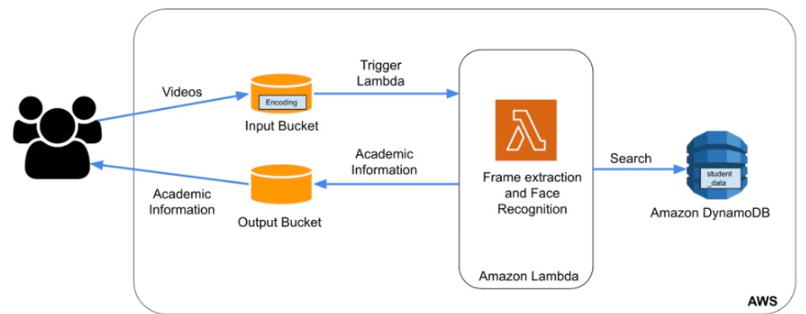

<br />
<div align="center">
<h2 align="center">Smart Classroom</h2>


</div>

Our cloud app will include a smart classroom assistant for educators. This assistant collects videos from the user's classroom, performs face recognition on the collected videos, searches the database for the recognized students, and returns the relevant academic information for each student to the user. This app's architecture is depicted in the diagram below.


### Built With

The application is powered by Amazon Lambda as a cloud resource that can be deployed/scaled as needed. We used DynamoDB to store personal information, S3 to store videos and final output CSV files, and ECR to store Docker Container Images.
<!-- GETTING STARTED -->
## Getting Started

To get a local copy up and running follow these simple steps.

### Prerequisites

* Miniconda
  ```sh
  curl https://repo.anaconda.com/miniconda/Miniconda3-latest-MacOSX-x86_64.sh -o ~/miniconda.sh
  bash ~/miniconda.sh -b -p
  rm ~/miniconda.sh
  
  source $HOME/miniconda3/bin/activate
  ```
* Python 3.8
  ```sh
    conda create -n py38 python=3.8
    ```
* Docker
  [Get Docker](https://docs.docker.com/get-docker/)

* Create S3 Input and Output Buckets to store files.

* Configure AWS ECR to store Docker container images.

* Set up AWS DynamoDB and load the personal information into it.

### Installation

Steps to install and set up the app.

1. Clone the repo
   ```sh
   git clone git@github.com:pavankramadugu/smart-classroom-paas.git
   ```

2. Add AWS account access and secret keys here at,  

   `handler.py`: [Handler](https://github.com/pavankramadugu/smart-classroom-paas/blob/master/handler.py#L15,L16)

3. Add your S3 Bucket and DynamoDB table details here at,  

   `handler.py`: [Handler](https://github.com/pavankramadugu/smart-classroom-paas/blob/master/handler.py#L11,L13)


3. Build the Docker Container Image
   ```sh
   docker build -t smart-classroom .
   ```
4. After the build completes, tag your image so you can push the image to the specific ECR.
   ```
   docker tag smart-classroom:latest <ECR ID>.dkr.ecr.us-east-1.amazonaws.com/smart-classroom:latest
   ```
   
5. Run the following command to push this image to your newly created AWS repository.
   ```
   docker push <ECR ID>.dkr.ecr.us-east-1.amazonaws.com/smart-classroom:latest
   ```
6. Setup the Lambda using this container image from the ECR with the appropriate architecture based on the platform on which you built your docker image. Remember to increase the lambda function timeout and memory as needed by the function.

<!-- USAGE EXAMPLES -->
## Usage

Users submit videos to your S3 input bucket. When a new video is added to the input bucket, the Lambda function is triggered to process it. When a new video is added to the input bucket, the Lambda function is triggered to process it. The Lambda function then employs the Python face recognition library to recognize faces in the frames. The Lambda function searches DynamoDB for the academic information of the first recognized face.
## Contributors

<!-- ALL-CONTRIBUTORS-LIST:START - Do not remove or modify this section -->
<!-- prettier-ignore-start -->
<!-- markdownlint-disable -->
<table>
  <tbody>
    <tr>
      <td align="center"><a href="https://pavankramadugu.github.io/"><br /><sub><b>Pavan K Ramadugu</b></td>
      <td align="center"><a href="https://github.com/snehalchaudhari98"><br /><sub><b>Snehal Chaudhari</b></td>
      <td align="center"><a href="https://github.com/JaydeepBhoite"><br /><sub><b>Jaydeep Bhoite</b></a></td>
    </tr>

  </tbody>
</table>


<!-- LICENSE -->
## License

Distributed under the MIT License. See `LICENSE.txt` for more information.
